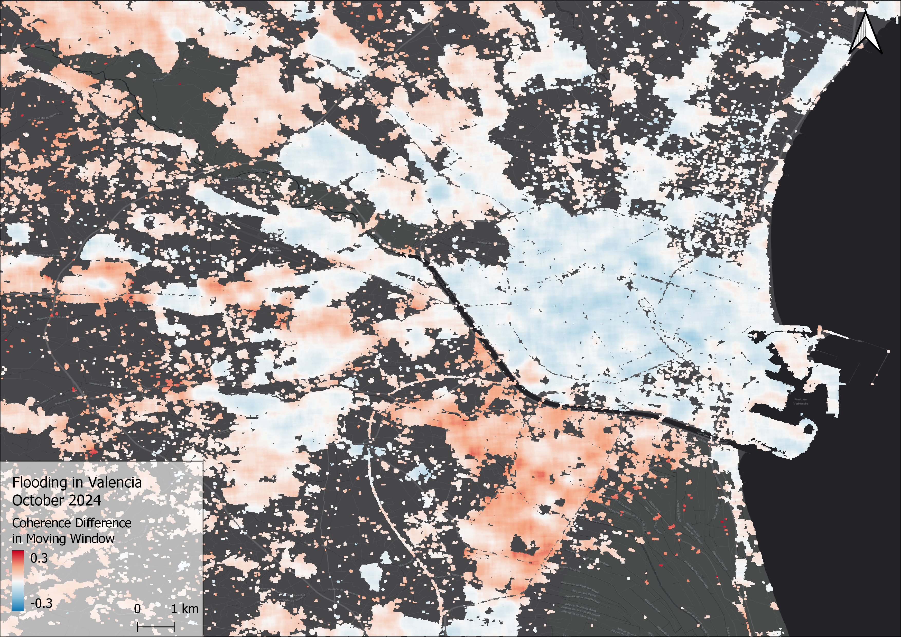

# Mapping Floods in Urban Areas

Hydrometeorological hazards make up for the majority of natural disasters. They go together with a high number of cacualties and economic damage. As most human and economic damage is done inside urban areas, these are the most vulnerable regions and need urgently data in form of maps for the response forces in case of disaster. 
This repository gives multiple options to create and improve flood maps in urban areas. The underlying methods were developed and published by scientist from JRC and LIST.

From the methodologies I developed these step-by-step guides during my work at UN-SPIDER in Bonn, which are ment to facilitate access to space based disaster response to the non-scientific community. The guides are planed to serve as new "Recommended Practices" for flood mapping to the UN-SPIDER knowledge portal: https://www.un-spider.org/advisory-support/recommended-practices

Recommended Practices are designed to bridge the gap between the scientific and disaster management community, to facilitate access to these - in case of disaster - very usefull methods, as they are documented step by step, and require little to no knowledge of remote sensing and geoanalysis. They furthermore rely only on open-access data and software.

I developed three guides, which differe in their applicability. As each flood is a bit different (different because of the meteorologic circumstances, the damage done or the land cover/use class affected) the three methods differ in their sensitivity with respect to the different flood circumstances.

In the following the three methods are shortly presented. For in depth documentation, you will find slides, code and maps for each practice in the respective folder in this repository.

## 1. Enhancing GFM derived Flood maps with Digital Terrain Models (S1)

This method was developed by Betterle and Salamon (2023) from JRC for improving flood maps, that are known to have limitations in certain areas. By propagating the flood into areas where the sensor is known to have limitations in detecting water, flood maps are improved.
For optical sensors these are clouds, whereas for radar satellites these are certain land cover classes like urban fabric or dense vegetation.
This practice uses the underlying algorithm called FLEXTH together with flood delineations and exclusion masks from the Global Flood Monitoring Database (GFM, link). As an open-source Digital Terrain Model we recommend the FABDEM, which is a derivate of the Copernicus 30m DEM.

The practice is successfull for large floods, i. e. with an input flood raster with enough pixels classified as flood, as the propagation distance is a function of the area of the original flooded area.

## 2. Enhancing GFM derived Flood maps with DTMs and Sentinel-2 (S1_S2)
This method builds on the previously used algorithm FLEXTH by not only using the GFM flood delineation, but also including a Sentinel-2 flood map. As optical data has major limitations during floodings, because of clouds, the method uses two incomplete flood maps, merges them, and propagates the flood into the area, where both sensors are insensitive to water.
In that way, the previously mentioned method can be improved, especially if GFM underestimates the flooded area.

## 3. Flood Mapping and Damage Assessment in Urban Areas with Sentinel-1 Interferometric Coherence (S1_Coherence)
Especially in dense urban areas, conventional methods using Sentinel-1 and Sentinel-2 imagery to detect water are challenged by urban structures. Even if single flood pixels are detected inside the urban areas, also FLEXTH can not reconstruct the area affected with the DTM, as propagation distance is a function of the flooded pixels.

Also certain types of floods, like flash floods, when water does not remain inside the city, but drains quickly and leaves nothing but damage, can not be detected with either optical (because of the clouds) or radar satellites (because of the dominance of vertical structures inside urban areas).
This is where SAR Interferometric Coherence comes in, which can be calcluated from Single Look Complex (SLC) Radar data, which is a certain type of radar imagery. SAR interferometry considers not only the intensity (i.e. the amplitude) of the SAR signal, but also the phase information. For more information, please find the documentation in the respective folder.

### References
Hawker, Laurence; Uhe, Peter; Paulo, Luntadila; Sosa, Jeison; Savage, James; Sampson, Christopher; Neal, Jeffrey (2022): A 30 m global map of elevation with forests and buildings removed. In Environ. Res. Lett. 17 (2), p. 24016. DOI: 10.1088/1748-9326/ac4d4f.

Betterle, Andrea; Salamon, Peter (2024): Water depth estimate and flood extent enhancement for satellite-based inundation maps. In Nat. Hazards Earth Syst. Sci. 24 (8), pp. 2817–2836. DOI: 10.5194/nhess-24-2817-2024.

Expert Flood Monitoring Alliance, McCormick, N., Salamon, P., Global Flood Monitoring (GFM) – Product User Manual. European Commission. 2023.

Pelich, Ramona; Chini, Marco; Hostache, Renaud; Matgen, Patrick; Pulvirenti, Luca; Pierdicca, Nazzareno (2022): Mapping Floods in Urban Areas From Dual-Polarization InSAR Coherence Data. In IEEE Geosci. Remote Sensing Lett. 19, pp. 1–5. DOI: 10.1109/LGRS.2021.3110132.
